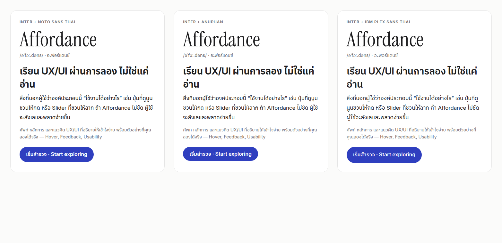

# 03 · Design system

Direction: **Apple-inspired × editorial minimalism** — calm, premium, readable. One accent colour, paper-toned neutrals, generous space, serif accents for English headwords. No glassmorphism, no decorative gradients, no gratuitous motion.

The live, always-accurate version is the **Design system page** (`/{locale}/design-system`): it parses the tokens from `src/app/globals.css` at build time, so documentation can’t drift from the product.

## Colour

Tokens are CSS variables on `:root` (light) and `:root[data-theme="dark"]` / `prefers-color-scheme: dark`; Tailwind reads them through `@theme inline` (`bg-surface`, `text-ink-2`, …).

| Pair | Light | Ratio | Dark | Ratio |
| --- | --- | --- | --- | --- |
| `--ink` on `--surface` | #1a1a1e / #ffffff | **17.3:1** | #f3f3f5 / #151518 | **16.4:1** |
| `--ink-2` on `--surface` | #5c5c66 / #ffffff | **6.6:1** | #ababb6 / #151518 | **8.0:1** |
| `--ink-3` on `--surface` *(decorative only)* | #82828c / #ffffff | 3.8:1 | #7f7f8a / #151518 | 4.6:1 |
| `--accent` on `--bg` (UI, ≥ 3:1) | #3343c4 / #fbfbfa | **7.3:1** | #9aa6ff / #0d0d10 | **8.5:1** |
| `--on-accent` on `--accent` | #ffffff / #3343c4 | **7.6:1** | #0b1033 / #9aa6ff | **8.1:1** |
| `--accent-ink` on `--surface` | #2b379f / #ffffff | **9.7:1** | #b9c1ff / #151518 | **10.5:1** |
| `--accent-ink` on `--accent-soft` | #2b379f / #eef0fc | **8.6:1** | #b9c1ff / #1c2040 | **9.1:1** |
| `--success` on `--surface` | #1d7348 / #ffffff | **5.8:1** | #5ccb8e / #151518 | **9.0:1** |
| `--error` on `--surface` | #be3229 / #ffffff | **5.7:1** | #ff8e84 / #151518 | **8.2:1** |
| `--warning` on `--surface` | #8a5300 / #ffffff | **6.3:1** | #f2c14e / #151518 | **10.8:1** |
| `--focus` on `--bg` (ring, ≥ 3:1) | #3343c4 / #fbfbfa | **7.3:1** | #9aa6ff / #0d0d10 | **8.5:1** |
| `--line-input` on `--surface` (≥ 3:1) | #8e8e98 / #ffffff | **3.2:1** | #6f6f7a / #151518 | **3.6:1** |

Ratios are truncated, never rounded up (4.48 must not read as 4.5). Rules:

- Reading text uses `--ink` or `--ink-2` only. `--ink-3` is for icons, separators and disabled states (WCAG 1.4.3 exempts inactive components).
- Colour is never the only signal: pass/fail, errors and states always carry an icon or text.
- **Kram** (คราม, Thai indigo) is the single accent — calm, trustworthy, distinct from the red/green of feedback colours.

## Typography

| Script | Font | Why |
| --- | --- | --- |
| Latin | **Inter** (variable, `opsz` axis) | Neutral, highly legible UI face; optical sizes keep headlines tight. |
| Thai | **Noto Sans Thai** | Chosen after rendering real comparisons (see below): a loopless, modern Thai that matches Inter’s proportions, with complete tone-mark coverage. |
| Accent / headwords | **Instrument Serif** (+ italic) | Editorial contrast for English UX terms (“*Affordance*”) and the brand wordmark (“UX*Lab*”). |
| Chinese, Japanese | System fonts (PingFang/Hiragino/Noto CJK/Yu Gothic…) via `:lang()` stacks | High quality everywhere, and avoids multi-megabyte web-font downloads (UXDR-09). |

Type scale (fluid with `clamp()`):

| Class | Size | Notes |
| --- | --- | --- |
| `type-display` | 44–92 px · 650 | Hero only |
| `type-h1` | 36–60 px · 650 | One per page |
| `type-h2` | 28–42 px · 650 | Section titles |
| `type-h3` | 20–24 px · 620 | Card/sub-section titles |
| `type-title` | 18 px · 620 | List items, card titles |
| `type-lead` | 18–21 px · 1.6 | Intro paragraphs |
| `type-body` | 17 px · 1.65 | Long reading |
| `type-caption` | 14 px · 1.5 | Meta, hints |
| `type-label` | 12 px · 600 · caps | Eyebrows, small labels |

Script-specific tuning: Thai headings get +0.15–0.2 line height for stacked tone marks and `word-break: keep-all` (break between phrases, not inside words); CJK headings drop negative letter-spacing and use 1.25–1.4 line height; English inside Thai/CJK keeps Latin rhythm via `:lang(en)`.

## Space, shape and elevation

- **Spacing:** Tailwind’s 4 px base (`1` = 4 px). Sections use 64–96 px vertical rhythm; cards 20–28 px padding.
- **Radius:** `xs 6 · sm 8 · md 12 · lg 20 · xl 28 · full` — larger surfaces get rounder corners; `corner-shape: squircle` where supported.
- **Elevation:** four soft shadows (`xs`→`lg`) that signal layering, never decoration. Dark mode relies more on surface steps than shadows.

## Motion

| Token | Spec | Use |
| --- | --- | --- |
| `fade-up` | 360 ms · ease-out-soft | New content appearing (feedback, results) |
| `pop` | 260 ms · spring | Confirmation marks, badges |
| `shake` | 360 ms | Error feedback (never on load) |
| `spin-slow` | 1.1 s linear | Loading spinners |

Interaction transitions are 150–300 ms. Under `prefers-reduced-motion: reduce` all animation and smooth scrolling stop; under `forced-colors: active` focus rings use `CanvasText`.

## Accessibility rules baked into the system

- Text ≥ 4.5:1; UI components and focus rings ≥ 3:1 (WCAG 1.4.3, 1.4.11).
- Primary actions ≥ 44 px tall (Apple HIG); everything ≥ 24 px (WCAG 2.5.8).
- Visible `:focus-visible` ring on every interactive element (verified by an automated Tab pass).
- Semantic HTML first; ARIA patterns from the APG only where HTML has no equivalent.
